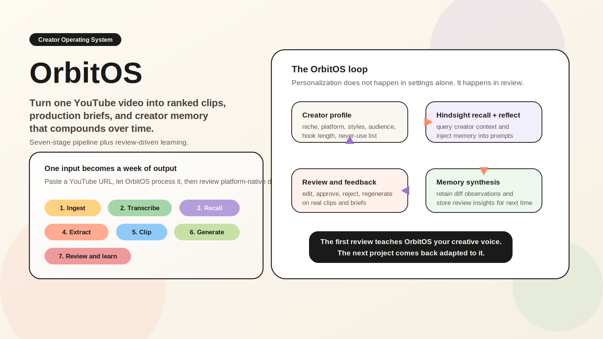
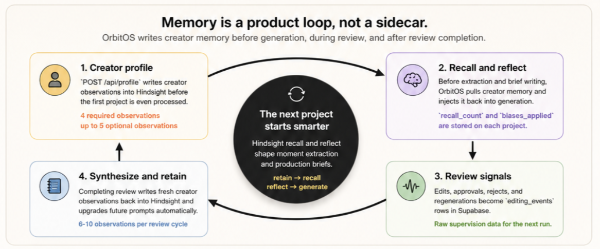
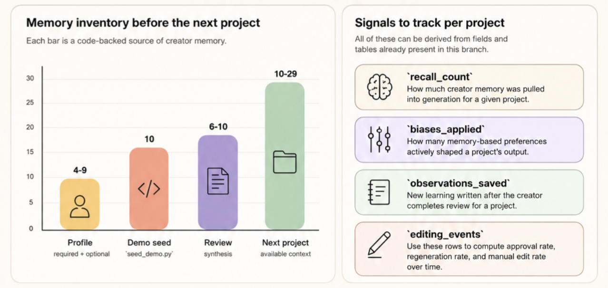
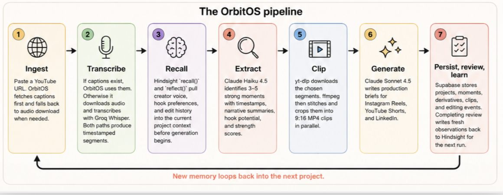
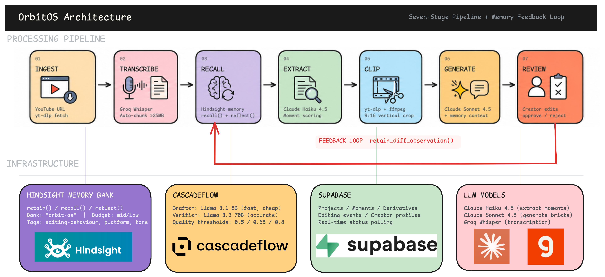

<p align="center">
  
</p>

<p align="center">
  
</p>

<p align="center">
  <a href="#what-is-orbitos">What is OrbitOS?</a> •
  <a href="#memory-that-compounds">Memory</a> •
  <a href="#what-orbitos-can-quantify-today">Metrics</a> •
  <a href="#processing-flow">Flow</a> •
  <a href="#architecture">Architecture</a> •
  <a href="#quick-start">Quick Start</a> •
  <a href="#api-surface">API</a>
</p>

<p align="center">
  
  
  
  
  
  
  
</p>

# OrbitOS

OrbitOS turns a long-form YouTube video into ranked moments, review-ready 9:16 clips, and platform-specific production briefs. The system does not stop at generation: every edit, approval, rejection, and regeneration becomes usable signal for the next project.

`v3-mvp` already ships the full review loop: ingest, transcript fallback, creator-memory recall, moment extraction, clip cutting, brief generation, inline review, and retained creator observations.

## What Is OrbitOS?

OrbitOS is built for creators who record once and need multiple outputs without rebuilding strategy from scratch every time.

| From one source video | OrbitOS produces | Why it matters |
| --- | --- | --- |
| Timestamped transcript segments | Structured input for selection and generation | The pipeline stays reviewable and deterministic |
| 3-5 strongest moments | Ranked candidate clips with rationale and scores | The best sections rise before editing starts |
| Instagram Reels, YouTube Shorts, and LinkedIn briefs | Hooks, scripts, captions, CTAs, Higgsfield prompts, and editing notes | Output is ready for a creator or editor to work from directly |
| Review signals and retained observations | Better memory context on the next run | The system learns from creator behavior instead of resetting |

The README below is aligned to the `v3-mvp` branch. Some internal identifiers in code still say `ContentOS`, but the product surfaced in this branch is OrbitOS.

## Memory That Compounds

<p align="center">
  
</p>

OrbitOS treats review as structured supervision.

1. `POST /api/profile` stores baseline creator observations in Hindsight.
2. `run_pipeline()` calls `recall()` and `reflect()` before extraction and brief generation.
3. Editing a derivative can trigger `retain_diff_observation()` immediately in the background.
4. `POST /api/projects/{id}/complete-review` synthesizes new observations from review events and stores them for the next project.

In code, that loop is explicit:

```python
recall_result = await recall_memories(
    query="How does this creator prefer their content? Hook styles, editing preferences."
)
reflection = await reflect_on_creator(
    query="Summarise this creator's content preferences, voice, and style."
)

background_tasks.add_task(
    retain_diff_observation,
    before=original["content"],
    after=body.content,
    platform=derivative["platform"],
    content_type=derivative["content_type"],
)

count = await synthesize_and_store_observations(str(project_id))
```

## What OrbitOS Can Quantify Today

<p align="center">
  
</p>

The current branch already stores enough information to measure whether the system is actually adapting. These are code-backed signals, not placeholder product metrics.

| Signal | Source in `v3-mvp` | What it measures |
| --- | --- | --- |
| `memory_context.recall_count` | `run_pipeline()` recall stage | how much prior creator memory was pulled into a project |
| `memory_context.biases_applied` | project `memory_context` | how strongly recalled preferences shaped downstream prompts |
| `observations_saved` | `POST /api/projects/{id}/complete-review` | how much new learning was retained after a review session |
| `editing_events` rows | Supabase `editing_events` table | the raw supervision signal from the creator |
| `approval_rate` | derived from `approve` and `reject` events | whether output fit is improving over time |
| `regeneration_rate` | derived from `regenerate` events | where the system is still missing creator expectations |
| `manual_edit_rate` | derived from `edit` events | how often generated output still needs rewriting |
| `observation_growth` | retained creator observations over time | whether creator memory is compounding across projects |

Useful formulas from the current schema and routes:

```text
approval_rate        = approvals / (approvals + rejects)
regeneration_rate    = regenerations / reviewed_derivatives
manual_edit_rate     = edits / generated_derivatives
memory_utilization   = biases_applied / max(recall_count, 1)
observation_growth   = retained_creator_observations over time
```

## Processing Flow

<p align="center">
  
</p>

| Stage | What happens in `v3-mvp` | Primary implementation |
| --- | --- | --- |
| 1. Ingest | Resolve a YouTube source into captions first, then fall back to downloadable audio when needed | `backend/app/infrastructure/youtube.py` |
| 2. Transcribe | Produce timestamped transcript segments with Groq Whisper when captions are unavailable | `backend/app/infrastructure/transcription.py` |
| 3. Recall | Load creator memory through `recall()` and `reflect()` before downstream generation | `backend/app/infrastructure/hindsight.py` |
| 4. Extract | Select the strongest 3-5 moments with Claude Haiku 4.5 | `backend/app/domain/moments.py` |
| 5. Clip | Cut and crop 9:16 vertical MP4 clips in parallel | `backend/app/infrastructure/clip_extraction.py` |
| 6. Generate | Produce platform-specific production briefs with Claude Sonnet 4.5 | `backend/app/domain/generation.py` |
| 7. Persist | Save projects, moments, derivatives, clips, and review state | `backend/app/infrastructure/supabase.py` |

### Project Lifecycle

```text
uploaded -> processing -> ready_for_review -> archived
```

### Typical Workflow

1. Save a creator profile so OrbitOS has a baseline memory bank.
2. Create a project from a YouTube URL.
3. Let the background pipeline produce moments, clips, and production briefs.
4. Review the outputs by editing, approving, rejecting, or regenerating derivatives.
5. Complete review so the next project starts with retained creator observations.

## Architecture

<p align="center">
  
</p>

The architecture export above is the repo-owned system diagram. For `v3-mvp`, there is one implementation detail worth reading alongside it: the main extract and generate stages now call Anthropic directly, while CascadeFlow remains in the branch for review synthesis and the existing cost-routing compatibility surface.

OrbitOS is split into four runtime layers:

- a Next.js studio for project creation, review, profile setup, intelligence views, and cost visibility
- a FastAPI backend that runs the seven-stage job in the background
- a creator-memory layer built on Hindsight, with review synthesis flowing back into retained observations
- Supabase plus media tooling for persistence, clip extraction, and status updates

## Quick Start

### 1. Configure environment variables

```bash
cp backend/.env.example backend/.env
```

Fill in:

- `SUPABASE_URL`
- `SUPABASE_SERVICE_ROLE_KEY` or `SUPABASE_API_KEY`
- `GROQ_API_KEY`
- `ANTHROPIC_API_KEY`
- `HINDSIGHT_BASE_URL`
- `HINDSIGHT_API_KEY`

Frontend:

```bash
echo 'NEXT_PUBLIC_API_URL=http://localhost:8000/api' > frontend/.env.local
```

### 2. Apply Supabase migrations

Run these in order in the Supabase SQL editor:

1. [`supabase/migrations/001_initial_schema.sql`](supabase/migrations/001_initial_schema.sql)
2. [`supabase/migrations/002_creator_profile.sql`](supabase/migrations/002_creator_profile.sql)
3. [`supabase/migrations/002_v2_claude_engine.sql`](supabase/migrations/002_v2_claude_engine.sql)

### 3. Start the stack

```bash
docker compose up --build
```

The first backend build is slower because the image installs `ffmpeg` and native build tools.

Default endpoints:

- Frontend: `http://localhost:3000`
- Backend API: `http://localhost:8000`
- Health check: `http://localhost:8000/health`

### 4. Optional local development

Backend:

```bash
cd backend
python -m venv .venv
source .venv/bin/activate
pip install -r requirements.txt
uvicorn app.main:app --host 0.0.0.0 --port 8000 --reload
```

Frontend:

```bash
cd frontend
npm install
npm run dev
```

## API Surface

| Method | Endpoint | Purpose |
| --- | --- | --- |
| `GET` | `/health` | Service health |
| `POST` | `/api/projects` | Create a project and kick off the pipeline |
| `GET` | `/api/projects` | List all projects |
| `GET` | `/api/projects/{project_id}` | Fetch one project with moments and derivatives |
| `POST` | `/api/projects/{project_id}/complete-review` | Synthesize creator observations after review |
| `PATCH` | `/api/derivatives/{derivative_id}` | Edit a derivative |
| `POST` | `/api/derivatives/{derivative_id}/approve` | Approve a derivative |
| `POST` | `/api/derivatives/{derivative_id}/reject` | Reject a derivative |
| `POST` | `/api/derivatives/{derivative_id}/regenerate` | Regenerate with optional guidance |
| `POST` | `/api/profile` | Save creator profile and write profile memories |
| `GET` | `/api/profile` | Load saved creator profile |
| `GET` | `/api/profile/status` | Check if profile exists |
| `GET` | `/api/intelligence/graph` | Build the global intelligence graph from Hindsight |
| `GET` | `/api/clips/{project_id}/{moment_id}.mp4` | Serve extracted clip files |

### Example: create a project

```bash
curl -X POST http://localhost:8000/api/projects \
  -H 'Content-Type: application/json' \
  -d '{
    "url": "https://www.youtube.com/watch?v=dQw4w9WgXcQ",
    "target_platforms": ["instagram_reels", "youtube_shorts", "linkedin"],
    "video_intent": {
      "topic": "How to build an AI product",
      "goal": "teach_skill"
    }
  }'
```

## Repository Layout

```text
backend/
  app/
    api/             FastAPI routes and schemas
    domain/          Pipeline, generation, memory, moment extraction
    infrastructure/  Supabase, Hindsight, CascadeFlow, Anthropic, Groq, YouTube, clip extraction
  seed/              Demo memory seeding

frontend/
  app/               Landing page plus authenticated studio routes
  components/        Review UI, intelligence graph, onboarding, clip preview, cost panel
  lib/               API client, types, export helpers

supabase/migrations/
  Schema for projects, moments, derivatives, editing events, and creator profile

docs/superpowers/
  Product plans and architecture specs
```

## Key Implementation Files

- [`backend/app/domain/processing.py`](backend/app/domain/processing.py) — seven-stage orchestration and project status updates
- [`backend/app/api/routes.py`](backend/app/api/routes.py) — project, derivative, profile, clip, and intelligence endpoints
- [`backend/app/domain/memory.py`](backend/app/domain/memory.py) — review synthesis, observation storage, and diff-based retention
- [`backend/app/infrastructure/hindsight.py`](backend/app/infrastructure/hindsight.py) — bank initialization, recall, reflect, and retain
- [`backend/app/infrastructure/cascadeflow.py`](backend/app/infrastructure/cascadeflow.py) — synthesis agent and cost telemetry helpers
- [`frontend/components/intelligence-panel.tsx`](frontend/components/intelligence-panel.tsx) — project-level memory visibility
- [`frontend/components/intelligence-graph.tsx`](frontend/components/intelligence-graph.tsx) — creator memory graph
- [`frontend/components/cost-panel.tsx`](frontend/components/cost-panel.tsx) — legacy routing and cost surface in the UI

## Built With

- Next.js 16 and React 19 for the studio UI
- FastAPI and Pydantic for the backend API
- Hindsight for creator memory recall, reflection, and retention
- Anthropic Claude Haiku 4.5 for moment extraction
- Anthropic Claude Sonnet 4.5 for production-brief generation
- Groq Whisper Large V3 Turbo for transcription fallback
- Supabase for project state, derivatives, editing events, and creator profiles
- yt-dlp and ffmpeg for clip extraction and 9:16 outputs
- CascadeFlow for review synthesis and cost-routing compatibility
